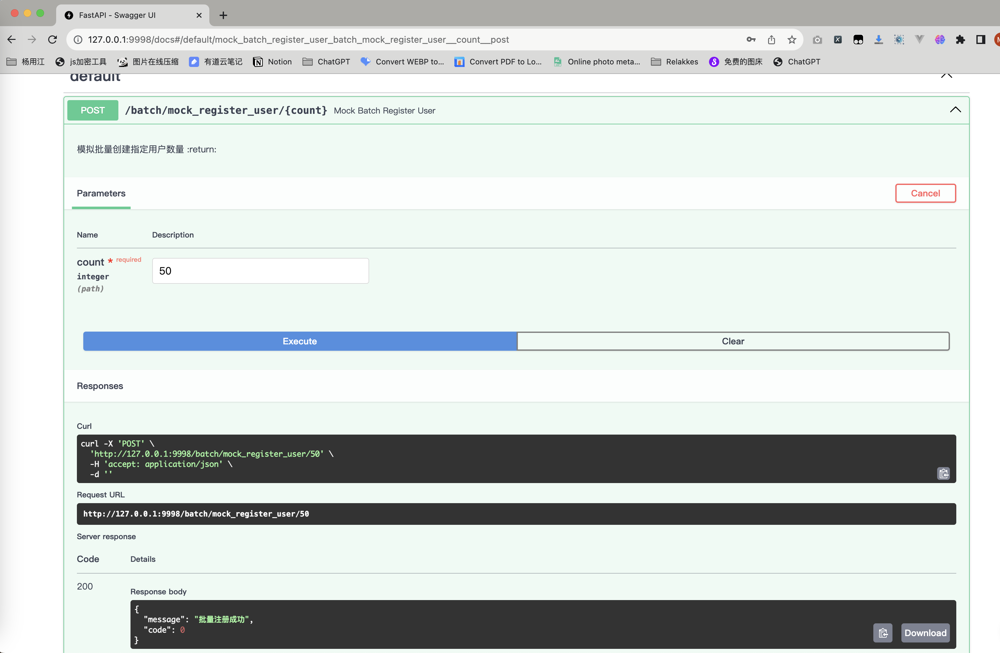
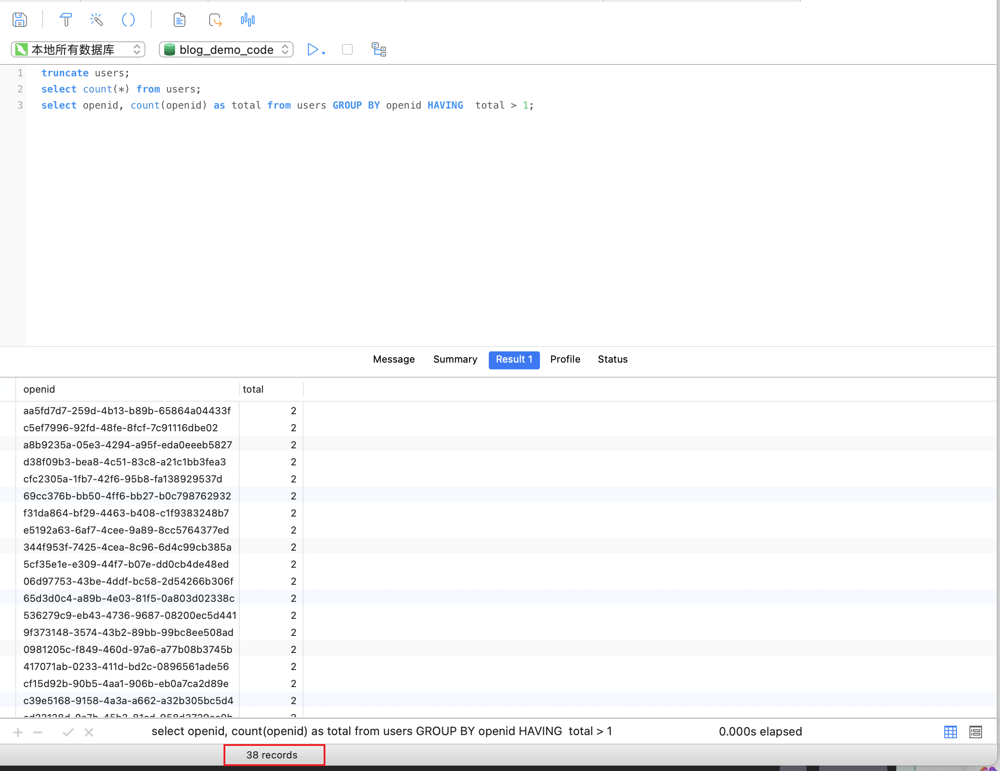

## Python协程在并发场景下的幂等性问题

> 案例背景：之前我做过的项目中，有一个小程序，其中有一段逻辑是关于小程序用户注册的，具体的逻辑如下：  
> 每当有一个用户打开小程序后，如果该用户没有注册过，则会调用后端的注册接口进行注册传递小程序用户识别的一些信息,
> 后端代码在实现过程中会基于小程序唯一识别信息`openid`来进行判断该用户是否已注册。
> 该接口一直运行的也没啥问题，直到有一次我们在对对用户数据表进行数据处理时，偶然发现小程序用户表里 `minip_user`竟然有少量的重复数据，也就是同一个 `openid`的记录不止 1条

接下来会先介绍一下一些基本概念，然后模拟之前项目的接口复现该问题，最后分别使用了三种解决方案来解决上面这个案例背景中出现的问题

## 协程

Python 的协程是一种**轻量级的并发编程方式**，它可以在**单线程内**实现多任务并发执行。协程的实现依赖于事件循环机制，即由一个主循环负责调度所有的协程任务。

当一个协程需要等待某个事件发生时，它可以使用 await 关键字将控制权交还给事件循环，等待事件发生后再由事件循环重新调度执行。在等待事件发生期间，该协程并不会阻塞整个程序的运行，而是将控制权交给其他协程，从而实现了并发执行。

事件循环会不断地轮询所有注册的协程任务，当某个协程任务准备好时，事件循环会将其加入到运行队列中，等待执行。当某个协程任务需要等待某个事件时，事件循环会将其挂起，并将其加入到等待队列中，等待事件发生后再重新调度执行。

协程的实现需要使用 asyncio 模块提供的相关函数和装饰器，比如 async def 声明协程函数、await 关键字等。在协程中，可以使用 async with 和 async for 等语法来实现异步上下文管理器和异步迭代器。

## 幂等性
在计算机科学和网络通信中，"幂等性"（Idempotence）是指一个操作的重复执行不会产生额外的影响，即使该操作被执行多次，结果仍然是相同的。无论执行一次还是多次，系统的状态都只会改变一次。  

在简单的用户注册场景中，幂等性的概念可以这样理解：
假设有一个用户注册的接口，用户通过发送请求来注册。这个接口是幂等的，意味着无论用户注册请求被执行一次还是多次，最终的结果都应该是相同的。

具体来说，如果用户提交了一次注册请求并成功注册，再次提交相同的注册请求不会导致额外的注册，也不会导致系统状态发生变化。系统能够正确地处理重复的请求，而不会产生重复的用户账户或其他不一致的结果。

保证用户注册接口的幂等性对于处理网络延迟、重试、以及其他可能导致同一请求被执行多次的情况很重要。这样可以确保系统在各种情况下都能保持一致性，而不会因为重复请求而引发问题，比如重复注册相同的用户账户。


## 注册接口没有幂等的 Bug 复现
### 注册接口
使用 `FastAPI` 框架来做注册接口的简单演示，请求模型这些都是简化的数据，代码也做了一定的简化

```python
# main.py

from typing import Dict

import db
from pydantic import BaseModel

# 用户请求模型 `UserRegistrationRequest`的定义如下
class UserRegistrationRequest(BaseModel):
    openid: str
    username: str
    password: str

# 注册接口如下，逻辑也非常的简单，从请求数据中拿到 `openid` 去数据库中查询是否存在，不存在则注册
@app.post("/register")
async def register_user(user_info: models.UserRegistrationRequest):
    """
    注册用户
    :param user_info:
    :return:
    """
    if not await models.check_user_exist_by_openid(user_info.openid):
        await models.add_new_user(user_info.model_dump())
        return JSONResponse({"message": "注册成功", "code": 0})
    return JSONResponse({"message": "注册失败，Openid已存在", "code": -1})
```

### 数据库相关代码
```python
# db.py

# 实现也很简单，一个判断是否`openid`存在的函数，一个新增用户的函数
async def check_user_exist_by_openid(openid: str) -> bool:
    """
    判断 openid 相关的用户是否已存在
    :param openid:
    :return:
    """
    sql: str = "select * from users where openid = %s"
    data = await db.user_db.get_first(sql, openid)
    if data:
        return True
    return False


async def add_new_user(user_item: Dict) -> int:
    """
    新增一条用户信息记录
    :param user_item:
    :return:
    """
    return await db.user_db.item_to_table(table_name="users", item=user_item)
```
用户表
```sql
CREATE TABLE `blog_demo_code`.`users` (
  `id` int NOT NULL AUTO_INCREMENT,
  `openid` varchar(255) CHARACTER SET utf8mb4 COLLATE utf8mb4_general_ci NULL DEFAULT NULL,
  `username` varchar(255) CHARACTER SET utf8mb4 COLLATE utf8mb4_general_ci NULL DEFAULT NULL,
  `password` varchar(255) CHARACTER SET utf8mb4 COLLATE utf8mb4_general_ci NULL DEFAULT NULL,
  PRIMARY KEY (`id`) USING BTREE
) ENGINE = InnoDB CHARACTER SET = utf8mb4 COLLATE = utf8mb4_general_ci ROW_FORMAT = Dynamic;
```

### 构造并发场景
下面的接口为模拟批量创建用户的场景，`count`参数为批量创建的数量  
大致逻辑为：构造用户请求参数 -> 创建异步任务 -> 同样的用户注册任务添加到任务列表中 -> 并发发起注册接口请求

```python
@app.post("/batch/mock_register_user/{count}")
async def mock_batch_register_user(count: int):
    """
    模拟批量创建指定用户数量
    :return:
    """
    # 构建指定数量的用户信息
    m_user = models.UserRegistrationRequest
    user_info_list: List[m_user] = []
    for index in range(1, count + 1):
        user_info_list.append(
            m_user(openid=str(uuid.uuid4()), username=f"mock_name_{index}", password=f"mock_pwd_{index}")
        )

    # 内部发起注册调用
    async def internal_register(user_item: models.UserRegistrationRequest):
        async with httpx.AsyncClient(base_url="http://localhost:9999") as async_client:
            response = await async_client.post("/register", json=user_item.model_dump())
            res = response.json()
            if res.get("code") == 0:
                print(f"openid:{user_item.openid} ---------> ", res.get("message"))

    # 批量发起注册请求
    task_list = []
    for _user_item in user_info_list:
        # 重放请求，模拟同样请求参数，多次调用注册接口
        task = asyncio.create_task(internal_register(_user_item),name=f"{_user_item.openid}_1")
        duplicate_one_task = asyncio.create_task(internal_register(_user_item), name=f"{_user_item.openid}_2")        
        task_list.append(task)
        task_list.append(duplicate_one_task)        
    await asyncio.gather(*task_list)

    return JSONResponse({"message": "批量注册成功", "code": 0})
```

发起批量注册请求,通过 `FastAPI`生成的 `OpenAPI`来进行调试，本次注册数量为 50
> 接下来发起调用后，我们去数据库查询用户表的数据



按照 `openid` 字段进行分组统计，看看是否有重复数据
```sql
select openid, count(openid) as total from users GROUP BY openid HAVING  total > 1;
```
50 个用户注册请求，在对每一次注册请求回放后，数据库中竟然出现了 38 条重复数据！！！！  

真实业务中可能不会有那么多批量的注册请求会被重放，但是保不齐会出现重放请求的概率，所以上面的这个注册接口显然是不符合业务逻辑，没有严格幂等  
之前我经手的一个项目中就发现了上面这个问题，这是真实客观存在的，而且隐藏的很深，要不是做数据处理，估计这个 bug 还会隐藏很久

## Bug 原因分析
从协程机制中可以看出，注册接口中的 `if not await models.check_user_exist_by_openid(user_info.openid):` 这个业务逻辑判重写法，当在较短时间内如果不存在用户请求重放，是没有太大问题的。  

但是问题就是出在我们是并发的发起注册接口调用，并且每个用户注册请求都进行了回放，虽然我们批量注册的用户数量为 50，但因为回放的原因，总共发起了100 次注册请求，其中 50 次是重复的  

当同一个用户的两次注册请求分别进行到 `check_user_exist_by_openid` 的这个函进行判重时，await 关键字会交出控制权并将自身放入到asyncio 管理的事件循环中，当事件循环在调度这两次判断重复的协程任务时，很有可能出现的场景：  

在极短的时间内两个函数紧挨着的被事件循环所调用，然后去查 mysql 中的用户表，因为都发现数据库中没有对应的`openid`值，然后自然返回 False,执行插入操作，故而造成了数据重复的 bug。

## 如何避免上面的 Bug

### 解决方案 1 - 唯一索引
如果在业务上检查重复的字段是唯一性的，那么给该字段加上唯一索引，例如 `openid`字段
```sql
ALTER TABLE users ADD UNIQUE INDEX idx_openid (openid)
```
加上唯一索引后重复数据的插入就会报错`Duplicate entry 'xxxxx' for key 'idx_openid`，业务代码中捕获改错误即可

### 解决方案 2 - 互斥锁 Lock
针对 `openid`的建立一个属于它的互斥锁，来处理同一个 `openid`多次调用注册接口的情况，具体代码优化如下：
```python
import anyio

# 用于存储每个 openid 对应的锁
openid_locks = {}

@app.post("/register_asyncio_lock")
async def register_user(user_info: models.UserRegistrationRequest):
    """
    注册用户 - 互斥锁Lock()
    :param user_info:
    :return:
    """
    lock = openid_locks.setdefault(user_info.openid, anyio.Lock())
    async with lock:
        if not await models.check_user_exist_by_openid(user_info.openid):
            await models.add_new_user(user_info.model_dump())
            return JSONResponse({"message": "注册成功", "code": 0})
        return JSONResponse({"message": "注册失败，Openid已存在", "code": -1})
```

### 解决方案 3 - 分布式锁来
利用 redis SETNX 命令来完成分布式锁
SETNX 是 Redis 中的一个命令，用于将键（key）的值设置为指定的字符串，仅当键不存在时。SETNX 的含义是 "SET if Not eXists"。
下面是一个简单的利用 redis SETNX命令来防止
```python
@app.post("/register_redis_lock")
async def register_user(user_info: models.UserRegistrationRequest):
    """
    注册用户 - 分布式锁
    :param user_info:
    :return:
    """
    redis_conn = redis.StrictRedis(host='localhost', port=6379, db=0,
                                   password=os.getenv("REDIS_DB_PWD", "you redis db pwd"))

    lock_name = f"register_lock:{user_info.openid}"

    # 尝试获取分布式锁
    identifier = acquire_lock(redis_conn, lock_name)
    if not identifier:
        return JSONResponse({"message": "注册失败，无法获取锁", "code": -1})

    try:
        # 检查用户是否已存在
        if not await models.check_user_exist_by_openid(user_info.openid):
            # 用户不存在，进行注册
            await models.add_new_user(user_info.model_dump())
            return JSONResponse({"message": "注册成功", "code": 0})
        else:
            return JSONResponse({"message": "注册失败，Openid已存在", "code": -1})
    finally:
        # 释放分布式锁
        release_lock(redis_conn, lock_name, identifier)


def acquire_lock(_redis_conn: redis.Redis, lock_name: str, acquire_timeout=10):
    identifier = str(time.time())  # 生成一个唯一的标识符
    lock_key = f"lock:{lock_name}"

    # 尝试获取锁，设置成功则返回标识符，否则等待一段时间再重试

    if _redis_conn.setnx(lock_key, identifier):
        _redis_conn.expire(lock_key, acquire_timeout)
        return identifier


def release_lock(_redis_conn, lock_name, identifier):
    lock_key = f"lock:{lock_name}"
    current_value = _redis_conn.get(lock_key)

    if current_value and current_value.decode() == identifier:
        _redis_conn.delete(lock_key)
    else:
        raise ValueError("Invalid lock identifier")

```

利用上面三种方案都能避免注册请求重放的问题  
- 方案一 由数据库来控制，这也是最简单的并且最能理解的，但是需要在业务代码种手动解决冲突问题
- 方案二 Lock锁也能解决这个问题，但是使用了互斥锁，性能会有影响
- 方案三 使用 redis SETNX 分布锁来解决，性能最好，也是用的比较多的一个方案（在分布式系统中，当多个节点需要对共享资源进行互斥访问时，可以使用分布式锁来确保在任何时刻只有一个节点能够持有锁。）
